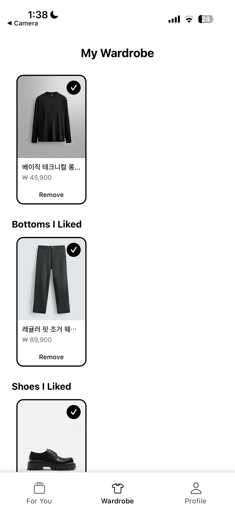
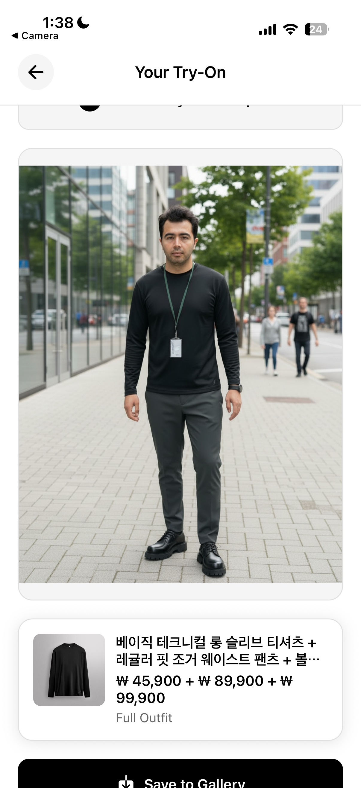

# StylerX - Personal Style & Color Analysis App

A React Native app built with Expo that helps users discover their personal color season, try on outfits virtually, and manage their wardrobe.

## Screenshots

### Before


### After


## Features

- 🎨 **Personal Color Analysis** - AI-powered color season detection from photos
- 👔 **Virtual Try-On** - See how outfits look on you before buying
- 👕 **Wardrobe Management** - Save and organize your favorite items
- 📱 **Outfit Swiping** - Discover new styles with Tinder-like swiping
- 👤 **User Profiles** - Track your color analysis results and preferences

## Prerequisites

- **Node.js** (v18 or higher)
- **npm** or **yarn**
- **Expo CLI** (installed globally or via npx)
- **iOS Simulator** (for Mac) or **Android Studio** (for Android development)
- **Expo Go app** (optional, for testing on physical devices)

## Quick Start

### 1. Install Dependencies

```bash
npm install
```

### 2. Start the Development Server

```bash
npm start
```

or

```bash
npx expo start
```

### 3. Run on Your Device/Simulator

After starting the server, you'll see options to:

- Press `i` to open in **iOS Simulator**
- Press `a` to open in **Android Emulator**
- Scan QR code with **Expo Go** app on your phone
- Press `w` to open in **web browser**

## Available Scripts

```bash
# Start development server
npm start

# Start with tunnel (for testing on physical devices)
npm run start:tunnel

# Run on iOS
npm run ios

# Run on Android
npm run android

# Run on web
npm run web

# Lint code
npm run lint
```

## Project Structure

```
expo_project/
├── app/                    # Main app screens (file-based routing)
│   ├── (tabs)/            # Tab navigation screens
│   ├── onboarding/       # Onboarding flow
│   └── ...
├── components/            # Reusable components
├── contexts/              # React contexts (Auth, etc.)
├── utils/                 # Utility functions
└── assets/               # Images and static assets
```

## API Configuration

The app connects to a backend API. The base URL is configured in individual screen files:

```typescript
const API_BASE_URL = "https://stylist-ai-be.onrender.com";
```

## API Endpoints

### Authentication

| Method | Endpoint | Description | Auth Required |
|--------|----------|-------------|---------------|
| `POST` | `/api/auth/register` | Register a new user | No |
| `POST` | `/api/auth/login` | Login user | No |

**Request Body (Register/Login):**
```json
{
  "email": "user@example.com",
  "password": "password123"
}
```

### Color Analysis

| Method | Endpoint | Description | Auth Required |
|--------|----------|-------------|---------------|
| `POST` | `/api/analyze/color/ensemble/hybrid?judge_model=openai` | Analyze color season using hybrid ensemble (2 models + 1 judge) | No |
| `POST` | `/api/analyze/color` | Analyze color season (single model - Gemini) | No |

**Request Body:**
```json
{
  "image": "data:image/png;base64,iVBORw0KGgo..." 
}
```

**Query Parameters (Hybrid):**
- `judge_model`: `"gemini"`, `"openai"`, or `"claude"` (default: `"openai"`)

### User Profile & Color Results

| Method | Endpoint | Description | Auth Required |
|--------|----------|-------------|---------------|
| `GET` | `/api/user/profile` | Get user profile information | Yes |
| `GET` | `/api/user/color/results?limit=1` | Get user's color analysis results | Yes |
| `POST` | `/api/user/color/save` | Save color analysis result to user profile | Yes |

**Request Body (Save Color Result):**
```json
{
  "personal_color_type": "string",
  "confidence": 0.95,
  "undertone": "warm",
  "season": "autumn",
  "subtype": "deep autumn",
  "reasoning": "Analysis reasoning..."
}
```

**Query Parameters (Get Results):**
- `limit`: Number of results to return (optional, default: all)

### Outfits & Wardrobe

| Method | Endpoint | Description | Auth Required |
|--------|----------|-------------|---------------|
| `GET` | `/api/outfit/season/{season}` | Get outfits by color season | No |
| `GET` | `/api/user/outfits/liked` | Get user's liked outfits | Yes |
| `POST` | `/api/user/outfits/like` | Like an outfit | Yes |
| `DELETE` | `/api/user/outfits/like/{item_id}` | Unlike an outfit | Yes |

**Request Body (Like Outfit):**
```json
{
  "item_id": "string"
}
```

### Virtual Try-On

| Method | Endpoint | Description | Auth Required |
|--------|----------|-------------|---------------|
| `POST` | `/api/try-on/generate-full-outfit/on-sequential` | Generate full outfit try-on (sequential processing) | No |
| `POST` | `/api/try-on/generate` | Generate single item try-on | No |

**Request Body (Full Outfit):**
```json
{
  "user_image": "data:image/png;base64,...",
  "upper_image": "data:image/png;base64,...",
  "lower_image": "data:image/png;base64,...",
  "shoes_image": "data:image/png;base64,..."
}
```

**Response (Full Outfit):**
```json
{
  "try_on_full_outfit_on_sequential_image": "data:image/png;base64,...",
  "status": "success",
  "message": "Outfit try-on on sequential image generated successfully"
}
```

### Authentication Headers

For authenticated endpoints, include the Bearer token:

```typescript
headers: {
  "Authorization": `Bearer ${access_token}`,
  "Content-Type": "application/json",
  "Accept": "application/json"
}
```

## Key Technologies

- **Expo** ~54.0.22
- **React Native** 0.81.5
- **React** 19.1.0
- **Expo Router** (file-based routing)
- **TypeScript**
- **Expo Camera** (for photo capture)
- **Expo Image Picker** (for gallery access)

## Permissions

The app requires the following permissions:
- **Camera** - For taking photos for color analysis
- **Photo Library** - For selecting and saving images

These are automatically requested when needed.

## Troubleshooting

### iOS Build Issues
```bash
cd ios
pod install
cd ..
npm run ios
```

### Clear Cache
```bash
npx expo start --clear
```

### Reset Project
```bash
npm run reset-project
```

## Development Notes

- Uses **Expo Router** for navigation (file-based routing)
- Authentication is handled via `AuthContext`
- Color analysis results are saved to user profile
- Virtual try-on uses sequential image processing

## License

Private project
